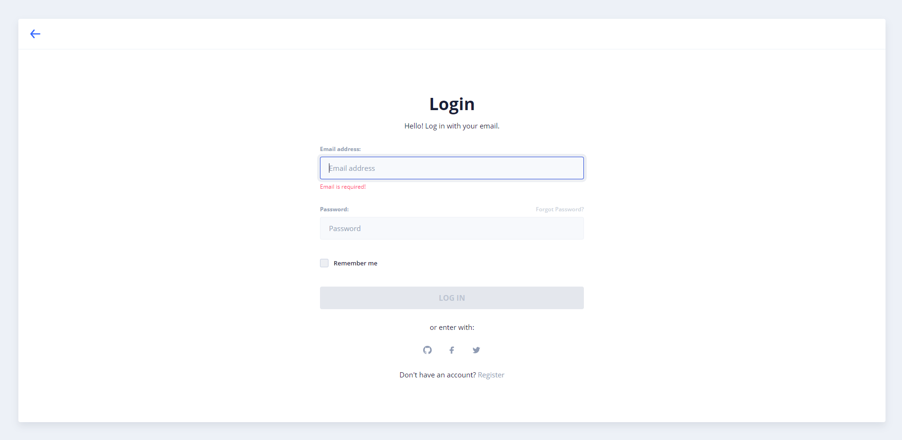

# Stocks ABC

This is a project for the subject "Operations research II" from the career "Advanced Technician in Information Systems".

The objective of this program is to classify stock by the ABC system. Then apply Pareto's stock policies depending on classification.

## Technologies

- Backend: Spring MVC
- Frontend: Angular with Nebular template

## Features

- Classify and list articles with their daily demand, with data provided form external database that has articles and sales.
- Manually modify a zone from an article, it will be ignored in subsequent classifications (reset with gear icon).
- Set configuration parameters for suppliers (revision time, delivery time, etc.).
- Calculate Model P and Model Q from classified articles and list them.
- Send modal notification if an article is close to its reorder point, or if it has no stock.
- Show graphs with relevant data about ABC classification.
- Calendar with events of the next delivery day of suppliers.

## Instructions

- Backend:
  - Run backend spring server.
- Frontend:
  - Do 'npm install' on frontend folder.
  - Then 'ng serve'

## Demo images

- Login
  
- Home
  
- Supplier Configuration
  
- Stock Clasification
  
- Stock Analisys
  
- Graphs
  
- Delivery Calendar
  
